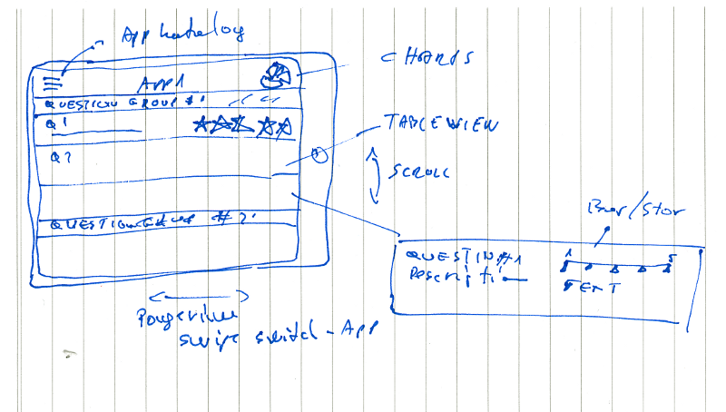
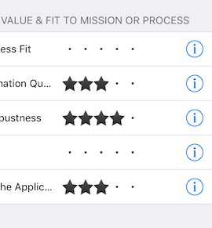

The whole story started at a usual team meeting. There was a discussion about using Gartner’s toolkit for [Application Fitness and Value Review](https://www.gartner.com/doc/3021817/toolkit-application-fitness-value-review). There was not much enthusiasm filling out another excel sheet. Someone mentioned that it would be more fun to do it with an App. A few jokes went around if it can be done in a weekend for a bottle of wine, and then we just moved on.

### Challenge accepted

I thought it would be inspirational to my fellow architects if I could make this happen. Here is the story of a weekend and a [Coding night @Zmags](http://www.meetup.com/ZmagsCodeNight/).

> Disclaimer — Gartner owns all the copyrights about this evaluation toolkit, therefor I think I cannot share it. For the same reason I cannot share the full source of the project. I have no money for lawyers.

### The product

It is all about evaluating a list of applications against certain set of smart criteria with rating, than visualise the result on a chart. So there is a list of application, a questionnaire, a rating between 1 and 5, some smart algorithm, and a chart. **That’s it!**

### Warning — Scope creep!

Than I started thinking about if this app could be a SaaS product. Could it be that companies maintaining their application portofolio fitness here? Can Gartner offer this as a service? And than I just went amok on features. Added authentication, web interface, Import / export and API, payment. What could give it more added value? Let’s have a timemachine-like history.

Oh and lets add authentication, and registration so the app can be sold as SaaS. Let’s make a full-scale application portfolio management extension etc.

> *STOP! This is a weekend project for fun!*

### Speaking of timeframe

I had a weekend plus a [coding meetup @Zmags](http://www.meetup.com/ZmagsCodeNight/) + commuting time. I made a total 6 hours at weekend (*Not bad with two small kids :)* ) + 6 hours at the meetup + 1 hour on the train. It was ca. 13 hours of pure coding fun.

### The Research

So I had to find out how to make the app. Here you can see the process and the results in telegramm style:

> *Google — Github — Cocoapods — Google — Stackoverflow — Google — Github — Stackoverflow, Cocoapods — Google — Google…plus I had some* [*experience*](https://babelfishapp.wordpress.com) *with iOS and Swift from earlier.*

### The results

*   [Infinite Scroll with custom UIPageViewController and swipe for filter data on tableview.](https://github.com/igroomgrim/Infinite-scroll-with-uipageviewcontroller) thx to [@igroomgrim](https://twitter.com/igroomgrim)
*   [Star rating](https://github.com/shuhrat10/STRatingControl) thx to [@shuhrat10](https://github.com/shuhrat10)
*   Charts

### The Pods

    use_frameworks!  
    target 'gartner-application-fitness' do  
      pod 'Alamofire',   
      pod 'SwiftyJSON',  
      pod 'STRatingControl'  
      pod 'FontAwesome.swift'  
      pod 'Charts'  
    end

### Coding

Yes, I clearly haven’t done any TDD or BDD on this. It was a pure “It should work on the first run” coding.

### The Contribution

I couldn’t find a star rating control that can work together with UITableCellView. No problem, lets find something close to and contribute. This is the best thing about Open Source!

### The aftermath

Coding is pure fun! I have demoed the app at the next team meeting. I’ve made a proof of concept. It is impressive how much can be done nowadays.
