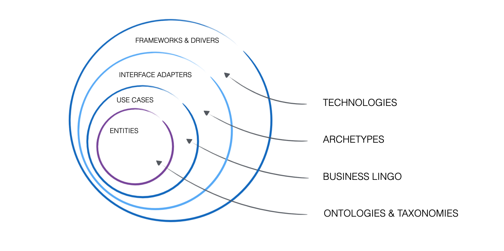

In my daily work, I've often struggled with the difficulties of interacting with and communicating enterprise architecture frameworks like TOGAF and ArchiMate. Their abstraction and complexity can be overwhelming for both stakeholders and fellow architects.

My experience in software engineering and architecture has taught me to find practical solutions. I turned to Uncle Bob's Clean Architecture to transform these convoluted frameworks into something manageable and intuitive.

Clean Architecture offers a straightforward modeling approach using simple principles and definitions by example, making complex frameworks more intuitive.

Let’s explore how Clean Architecture can be a secret weapon for crafting clear, effective models in your target architecture that not only simplifies the process but also enhances communication and understanding among all stakeholders.

### The Inspiration from Clean Architecture

Clean Architecture, designed by Robert C. Martin ("Uncle Bob"), aims to decouple software systems from frameworks, technologies, and interfaces, making them easier to manage and adapt. It organizes code into concentric circles, each representing a different aspect of the application with strict dependency rules that enforce a clear separation of concerns (SoC).

> Have you ever struggled with managing dependencies in your architecture? How did you handle it?

#### Core Principles

1. **Separation of Concerns (SoC)**: Each layer has a distinct responsibility, ensuring that business logic, user interface, and data access are separate.

2. **Dependency Rule**: Code dependencies can only point inward. Outer circles can depend on inner circles, but inner circles should not depend on outer circles.

#### The Circles

1. **Entities**: The innermost circle contains enterprise-wide business rules.
2. **Use Cases**: Encapsulates application-specific business rules.
3. **Interface Adapters**: Converts data from the use cases into a form suitable for the outer layers.
4. **Frameworks and Drivers**: The outermost layer includes web frameworks, databases, and external APIs.

> Which layer of Clean Architecture do you find most challenging to implement and why?

#### Example

Imagine an e-commerce application:

- **Entities**: Classes representing products and orders.
- **Use Cases**: Logic for processing orders and calculating prices.
- **Interface Adapters**: Controllers and presenters converting data for the user interface.
- **Frameworks and Drivers**: Database access and web server.

Let’s explore how these principles can help us craft effective models in our target architecture.

### Adapting Clean Architecture to Target Architecture

I have adapted Clean Architecture principles to create a framework specifically tailored for enterprise architecture. This structured model helps break down work into multiple aspects of target architecture and design solutions with decoupled concepts and context, providing a clearer picture.

**Entities, Ontologies, and Taxonomies**: Form the core of our data models, ensuring consistent and coherent data across the enterprise by defining structures, relationships, and standardizing terminology.

_Example: In an e-commerce system, entities might include Product, Customer, and Order. Ontologies and taxonomies define relationships between these entities and standardize terms like “product ID” or “order date” across the system._

**Business Capabilities/Functions/Processes**: Translate business needs into functional strategies to ensure alignment with business goals. These capabilities outline what the business does, guiding the development of solutions that meet strategic objectives and improve operational efficiency.

_Example: Business capabilities might include Inventory Management, Order Processing, and Customer Support. These functions ensure that inventory levels are maintained, orders are processed efficiently, and customer inquiries are handled promptly._

**Business Scenario Archetypes**: These archetypes address operational needs by categorizing business capabilities and corresponding technology solutions into distinct groups. They include:

- Automation: Focuses on streamlining operations, improving efficiency, and reducing manual effort through technologies like back-office automation, IoT integration, and robotic process automation (RPA).
- Decision Making: Encompasses tools and systems that provide business insights, facilitate informed decision-making, and ensure regulatory compliance through business intelligence (BI), compliance reporting, and decision support systems.
- Advanced Analytics: Leverages sophisticated data analysis techniques, including AI, machine learning, and classical statistical methods, to generate insights, make predictions, and support strategic decisions.

_Scenario archetypes might include automated inventory restocking (Automation), real-time tracking of shipments through IoT devices (Automation), and decision support systems for personalized marketing strategies (Decision Making and Advanced Analytics)._

**Technology Capabilities**: Focus on technological backbones like AI, data analytics, and cloud infrastructure that support the above elements. These capabilities provide the technical foundation needed to implement and support business processes, ensuring scalability, reliability, and innovation.

_Example: Technology capabilities might include AI for customer recommendations, data analytics for sales trends, and cloud infrastructure for scalable web hosting._

**Solutions, Systems, Apps, AI**: Represent the actual implementation, bringing all other elements to life in the enterprise’s application landscape.

_Example: This could include the deployment of an e-commerce platform, a mobile app for customers, and AI algorithms for personalized shopping experiences._

By mapping Uncle Bob's Clean Architecture circles to these layers, we can create a clear, manageable, and effective target architecture. Here's how they align:

1. **Entities**: Equivalent to Entities, Ontologies, and Taxonomies.
2. **Use Cases**: Maps to Business Capabilities/Functions/Processes.
3. **Interface Adapters**: Aligns with Business Scenario Archetypes.
4. **Frameworks and Drivers**: Corresponds to Technology Capabilities.
5. **Solutions, Systems, Apps, AI**: Represents the implementation layer, integrating all other elements.

Let’s explore how these principles can help us craft effective models and target architectures.

### A Practical Application

While the greatest potential of this approach lies in architecting a business domain end-to-end, let's explore practical examples of how it can be applied to specific scenarios.

#### Example #1 :Technology Capability Map

In my daily work, I've used this approach to separate discussions from concrete solutions and focus on defining the necessary technology capabilities for the given business domain. This technology capability map enables us to define the target state, desired technologies, and functional and non-functional requirements.

_Example capabilities include_: User Experience, Collaboration Technologies, Backoffice Automation, Insight Engines, Hybrid Integration Platform, Data Backbone, Data Governance, Unstructured Data Management, IoT (Internet of Things), IaaS/PaaS and Infrastructure, Advanced Networking, Compliance and Regulatory Technologies.

> What are some technology capabilities that you find essential in your business domain?

#### Example #2 : Solution Vision - Assessment

Another practical application could be to assess the current state landscape in the context of a specific problem-solution scenario. Using the circles and dependency principles can help guide the assessment process and focus on identifying and filling gaps.

For instance, in cases of misalignment or missing common terminology, the framework could help initiate an ontology/business information modeling exercise to establish a baseline for proper scoping.

_Example Scenario: Implementing a Customer Loyalty Program_

Define the core data structures for customers, loyalty points, and rewards. Create relationships between these entities to ensure data consistency across the system.

_Example_: Define entities such as Customer, LoyaltyAccount, and Reward. Standardize terms like "loyalty points" and "reward redemption date."

Then, move to the next circle...

### Conclusion

I hope you find this approach to adapting Clean Architecture for target architecture an exciting opportunity to tackle complex projects with a practical framework. It brings clarity and a more manageable execution of architecture tasks.

There are many practical details about the "how" and some tooling aspects. Stay tuned as I share more real-world scenarios and experiences over time. Let's try this approach together—please share your thoughts and comments on using this framework.