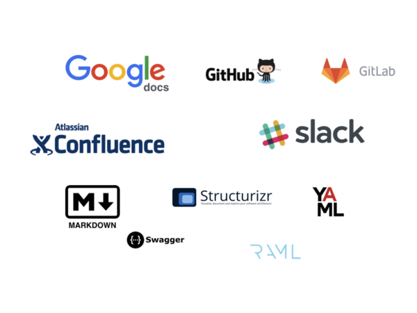
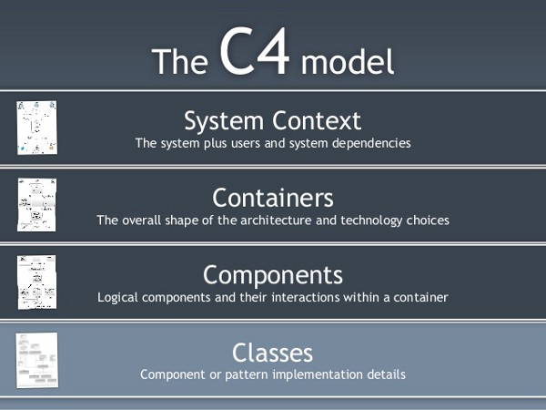

Earlier I wrote a post about principles, like [*separation of concerns*](https://medium.com/@zsim0n/separation-of-concerns-what-is-that-for-7f1792969948#.ql5raqi6f) and their role in software development. One of the reflections I got is the following:

> Do not follow the principles, if you do understand the system.

This statement was the inspiration for writing this post.

*What does it mean understanding the system? How can you do that? How can understanding the system be interpreted in the context of collaboration?*

### Understand the system

The discussions about understanding the system usually leads to the following argument about the agile manifesto:

> The meaning of “Working software over comprehensive documentation ” is for me : Read my the code, it is perfect and expressive enough to understand the whole system.

Is this o.k.? Not really.

> The purpose of software development is creating positive business impact — [Dan North](https://dannorth.net) : [The software that fits in your head](https://gotocon.com/dl/goto-amsterdam-2016/slides/DanNorth_SoftwareThatFitsInYourHead.pdf)

A software system is not only about the code but about the business value that it delivers.

Understanding a software should also include the surroundings. *How the architecture looks like? What kind of dependencies are there? How to deploy? What are the latest changes? Common issues, etc…*

For that you need living documentation.

### Living documentation for me is

*   good enough,
*   collaboratively edited,
*   up-to-date,
*   always online,
*   tagged and searchable,
*   stored as close as possible to the source code.

### Audience

Understanding the system depends also on who is trying to understand it. Different context requires different detail level, different presentation format and language. Let’s take a look into one of the possible segmentations:

#### The team

A development team usually would like to share technical insights about architecture, deployment, configuration. In that case the best is if the documentation living just inside the code repository in text format. Using formats like html, markdown delivers standard formatting, nice presentation. Documenting the code using commenting standards and documentat generators are good practices.

#### Stake holders

Projects, iterations or releases are the scene where people, teams or departments have to collaborate and synchronize their effort for delivering the right product. This requires another level of understanding of multiple systems. Architectural drawings, workflow and sequence diagrams, wireframes and the additional high level descriptions such as user stories or system descriptions are the necessary documentation for them.

#### Management

Decisionmakers also needs input. They are looking for high level overview and status. Different type of reports can fulfill that need.

### How much is good enough?

Documents and manuals shouldn’t represent handovers and gateways, instead they need to be the platform for sharing knowledge.

You can say that the documentation is enough when the selected audience are signaling that they have built confidence to the system. They can ask qualified questions, they can find their way and searching for answers.

### Collaboration

Also, writing documentation is not the most loved part of software development. Making it happen as a joint effort is important. The whole team needs to be involved so everyone gets ownership. Creating documentation should be a natural part of the delivery process.

*Easy, effortless, and as automatic as possible.*

### Tooling

There are really good tools in the wild today. Let’s take a look at a few examples.

#### Documentation as Code

Many repository manager like [Github](https://github.com), [Gitlab](https://about.gitlab.com) can render [markdown](http://kirkstrobeck.github.io/whatismarkdown.com/) files.

The README.md in the root folder can be the *“homepage of the repo”*. All the information for the newcomers can be placed there. What is this repository about. How and where to find informations in the repository. How to build, test and deploy the application.

A CHANGELOG.md can contain information on the history of the system and give feedback to release management.

Using commenting conventions such as [smart commits](https://confluence.atlassian.com/fisheye/using-smart-commits-298976812.html) can bring code and documentation integration to the next level.

The use of other human readable markup formats such as [Yaml](http://yaml.io), [Raml](http://raml.org) or [Swagger](http://swagger.io) leads to better editing experience and easy rendering.

#### Software architecture as Code

I would like to recommend to take a look into [Simon Brown](http://simonbrown.je)’s work on creating modern and living documentation for software architecture. Check the [C4 model](http://www.codingthearchitecture.com/2014/08/24/c4_model_poster.html) and [Structurizr](https://structurizr.com). You will find his [books](https://leanpub.com/book_search?search=simon+brown) and [presentations](http://www.codingthearchitecture.com/presentations/) exciting.

> The C4 software architecture model

*The “C4 model” is a simple hierarchical way to think about the static structures of a* ***software system*** *in terms of* ***containers****,* ***components*** *and* ***classes*** *(or* ***code****).*

*Structurizr does not provide an online “drag and drop” editor to create diagrams. Instead, you* ***create a software architecture model using code and upload it via the web API****. Here’s a simple example using Java.*

    `Workspace workspace = new Workspace("My model", "This is a model of my software system.");  
    Model model = workspace.getModel();  
      
    **Person user = model.addPerson("User", "A user of my software system.");  
    SoftwareSystem softwareSystem = model.addSoftwareSystem("Software System", "My software system.");  
    user.uses(softwareSystem, "Uses");**  
      
    ViewSet viewSet = workspace.getViews();  
    SystemContextView contextView = viewSet.createSystemContextView(softwareSystem, "context", "A simple example...");  
    contextView.addAllSoftwareSystems();  
    contextView.addAllPeople();  
      
    Styles styles = viewSet.getConfiguration().getStyles();  
    styles.addElementStyle(Tags.SOFTWARE_SYSTEM).background("#1168bd").color("#ffffff");  
    styles.addElementStyle(Tags.PERSON).background("#08427b").color("#ffffff");  
      
    StructurizrClient structurizrClient = new StructurizrClient("key", "secret");  
    structurizrClient.putWorkspace(1234, workspace);`

#### Collaborative documentation

Another achilles heel of the living documentation is when people actually have to produce text together. Writing is art. Don’t be shy asking for help! Use tools like [Google Docs](https://docs.google.com) for collaborative document editing. You will find fun writing a document in *pair programming* style. Use chat like [Slack](https://slack.com) for discuss your pain with the rest of the team.

#### Document as product

A document is also a product you are delivering. You need to agree with the stakeholders about the content. Ask them to give you a *table of contents, an abstract*. Agree on the *size* and the *format*. All of these should be part of the assignment’s accept criteria and part of your **definition of done** in general.

#### Online documentation

Any of these above has zero value if the documentation is not **accessible for everyone and searchable by anyone**. Use platforms that has tight integration with code repositories and enabling collaboration such as [Atlassian Confluence](https://www.atlassian.com/software/confluence). You can also turn a repository manager easily into knowledge sharing center.

Keep your solution simple and stupid. Custom theming and templates are not the point. Use the default package what you are getting out of the box. You can tune them later.

#### Security bias

The last topic is security, securing sensitive data. Trying to minimize risk shouldn’t stand in front of innovation and agility. Separate the sensitive informations from the rest of your documentation and encapsulate them into a protected area.

### Closing words

I have tried to highlight a few areas that could help creating living documentation. I hope there are some takeaways in the post. Long story short, software development should always be fun including writing the documentation.
