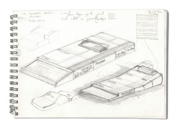
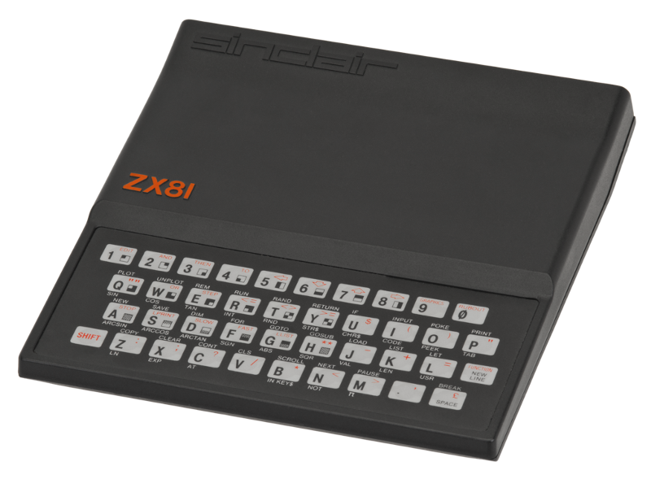

That was a great moment i my life when I first got my hands on the glorious ZX-81! Turning this superior machine on, fighting with BASIC, using hours and

hours than finally understand what does it mean *variable*, *loop*, *memory*, *address* was a joy. The continous stimulation and success gave me so much energy, I am still running on that boost.

Every time I am staring a new project or getting an assignment, I am still getting goosebumps like the first time.

The biggest thing working with software is the fact that it is **soft** for me. You can turn your imagination into (digital)reality. You can see the results instantly and alter them just after that.

You are continuously reaching to the next achievement with success. You can try things without the fear of *breaking* anything.

So don’t hesitate to start coding something! Your success is guarantied. Or more importantly, give this opportunity to your kids!

I am not the only one with these thoughts of course, here are some references about this topic:

*   [Hour of Code](http://code.org/)
*   [Kids should code: why ‘computational thinking’ needs to be taught in schools — The Guardien](http://www.theguardian.com/commentisfree/2014/dec/19/kids-should-code-why-computational-thinking-needs-to-be-taught-in-schools)
*   [Codecademy](http://www.codecademy.com/learn)
*   [Codie -A robotic toy that teaches kids the principles of coding](http://www.getcodie.com/)
*   [Raspberry Pi is a low cost, credit-card sized computer](http://www.raspberrypi.org/)

*Get hooked as I am!*

image credit: [http://en.wikipedia.org/wiki/ZX81](http://en.wikipedia.org/wiki/ZX81)
