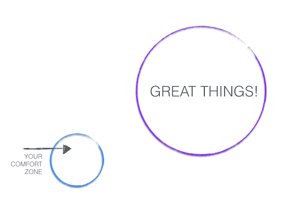
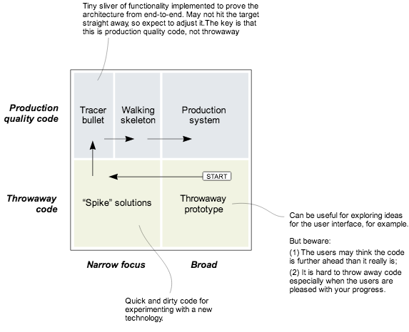

Software developers are always dreaming about well defined assignments with clear handovers. The infamous topics *definition of ready \[DoR\] and definition of done \[DoD\] are* playing great role in that.

Cruising on the happy path would be great, but usually the journey of delivery is a tricky exercise. Many times there are more questions than answers, especially at the beginning.

This post is about how to handle imperfection. Balancing between commitment, risk and fun.

#### **The paralysis by analysis**

*“…I cannot do this or that until I know all the details about the requirement…You have to give me a precise estimate on the task before you can start it…”*

Familiar?

These are typical symptoms of the fear of the *unknown*. There is no such thing as delivering perfection at the first run. There is always a point where [*good enough is good enough*](https://dzone.com/articles/applying-8020-rule-software).

> Your commitment has to focus on continuous improvement.

Believe in yourself, trust each other’s experience and expertise. A developer knows how to develop, a project manager knows how to handle projects and a tester knows how to test.

> Delivering is always a team effort.

#### Zero tolerance

Another challenge you are facing is handling risk. On the one end are the people who are ignoring the risks and trying to deliver at all cost. On the other end are the ones developing with zero tolerance against errors.

> The goal is to find the sweet spot.

Managing risk is about constant evaluation, adapting and changing. The goal is finding the sweet spot where risk is known and acceptable.

> Where are unknown there are always risk of failure.

### Great things happening out of your comfort zone

Today I would like to turn your focus on the power of experimenting. I would like to encourage you to fail and fail fast. I would like to show the advantages of executing multiple tracks and throwing away the ones that are not optimal for your needs. At the end you are only focusing on the one that leads you to success.

When you are firing up your favourite IDE, kickstarting a virtual environment and starting to code, you feel confident.

> This is your comfort zone.

Let’s step into the *unknown* by executing multiple experiments. Do it either *time-boxed* or with *reasonable small scope*. Try and drop ideas, visit edge cases. Collect and record as many experiences as you can.

Dealing with the unknown is mostly about going into the wrong direction. The great thing with software is that you can always write new code. Dropping a small chunk of experimental code costs almost nothing.

> Be prepared throwing code away.

Your goal is to find the path with the experiments that lead to solutions that can be deployed to production.

> Be patient

The agile (scrum) world has developed a nice terminology around this concept. Look into these articles about *Spikes, Tracer bullets, Research*:

[**Prototypes, Spikes and Tracer Bullets**  
*Here’s an attempt to classify various development techniques and the sequence in which they tend to be used.*blog.davidpeterson.co.uk](http://blog.davidpeterson.co.uk/2011/01/prototypes-spikes-and-tracer-bullets.html "http://blog.davidpeterson.co.uk/2011/01/prototypes-spikes-and-tracer-bullets.html")

[**Research, Spikes, Tracer Bullets, Oh My!**  
*Spike — a quick and dirty implementation, designed to be throw away, to gain knowledge. Research — broad, foundational knowledge-gaining to decide what to spike or give the ability to estimate…*www.gettingagile.com](http://www.gettingagile.com/2007/10/22/research-spikes-tracer-bullets-oh-my/ "http://www.gettingagile.com/2007/10/22/research-spikes-tracer-bullets-oh-my/")

[**Guidance - Spikes - Scaled Agile Framework**  
*If we knew what we were doing, it wouldn't be called research. -Albert Einstein Spikes are a special type of Enabler…*www.scaledagileframework.com](http://www.scaledagileframework.com/spikes/ "http://www.scaledagileframework.com/spikes/")

### Everything is production

You have seen theories and some terminology that might help you. Let’s take this topic to the next level.

In the era where [*everything can be code*](http://www.bmc.com/blogs/infrastructure-everything-code-changes-everything/) and there is [*continous delivery*](http://martinfowler.com/bliki/ContinuousDelivery.html) and *automated testing*, where tooling and infrastructure is cheap and accessible from everywhere to everyone, I would like to encourage you to do the following:

> Always produce production grade code and you should do it in a throwable / replaceable manner.

> Kill code fearlessly — [Dan North](http://dannorth.net)

> Challenge the status quo all day everyday.

More practically, when you are getting an assignment :

*   Start experimenting.
*   Demonstrate results regularly (weekly).
*   Always present alternatives.
*   Write tests from the very beginning. Do it TDD style if you can.
*   Define the *API first.*
*   Take care of acceptance tests (how your code look like from the user point of view) as well
*   Don’t forget the documentation. (Readme.md is good enough)
*   The code that *works on my machine* is not enough, take care of the deployment too.

### The examples

Finally let´s take a look at a few examples, how this approach could work:

1Let’s imagine your assignment is introducing social authentication to a node.js application. Let’s also assume that you are over all the ‘why we need this” discussion. There are no best practices or examples at your place how should you do this.

After you did the homework: Searching Google and Stackoverflow you ended up the following two alternatives:

[**Identity infrastructure, built for developers**  
*A universal identity platform for customers, employees and partners*auth0.com](https://auth0.com "https://auth0.com")

[**Passport**  
*Simple, unobtrusive authentication for Node.js*passportjs.org](http://passportjs.org "http://passportjs.org")

But now, doing documentation (buzzword) analysing and presenting marketing materials as arguments, you are just cloning and initializing one of the example applications from github.

When you are confident with the examples, you setup a demo for your stakeholder including your senior architect and you present them the to working application. They get hands-on experience with the solutions, instant feedback from a working application. They can make a fast decision.

2 Let’s look into a coding example, where your task is implementing some new features to the following code:

    `async1(function(){  
        async2(function(){  
            async3(function(){  
                async4(function(){  
                    ....  
                });  
            });  
        });  
    });`

You can follow the old habits and just put the new code into this [pyramid of doom](http://skaghost.herokuapp.com/pyramid-of-doom/)

or

You can challenge the status quo and refactor the code with promises before you are adding the new features.

[**Staying Sane With Asynchronous Programming: Promises and Generators**  
*Callback Hell, also known as Pyramid of Doom, is an anti-pattern seen in code of programmers who are not wise in the…*colintoh.com](http://colintoh.com/blog/staying-sane-with-asynchronous-programming-promises-and-generators "http://colintoh.com/blog/staying-sane-with-asynchronous-programming-promises-and-generators")

    `async1(function(){..})  
        .then(async2)  
        .then(async3)  
        .catch(function(){  
            // Solve your thrown errors here  
        })`

The result will be a much more readable code and developer happiness.

*[image credit : deathtothestockphoto.com](http://deathtothestockphoto.com)*

