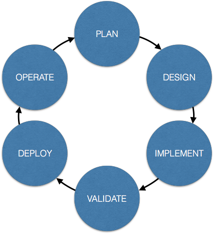
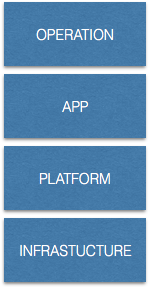
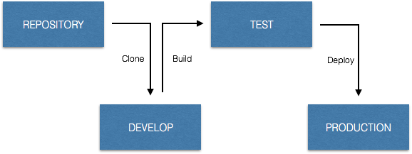

*&TLTR; If you are using Heroku or other modern PaaS solution you will feel confortable.*

#### *What is an application?*

Everything that is made of code is an *application* to me. They follow the same software development lifecycle practices.

<figcaption>Software lifecycle</figcaption>

> Back to the roots, the Software itself!

Yes, not only the app but infrastructure, platform configuration, monitoring, etc. are based on code and so they are all *applications.* This means you can also apply the same tooling and all the technical practices to them.

For example, you can run a CI server that builds environments. You can take it to the extreme and build your own build-server every time you need to build an application.

> They are not special!

Because everything is *code* you can put everything under *source control.* That means you get history and traceability. The code is extremely accessable for everyone and ready for collaboration.

    git clone

#### Boundaries

Anything inside this repository is part of your application, delivering features. Everything outside is out of your scope.

> This is the context of your application.

Expanding the context to include *everything* that is necessary for releasing an app leads to the concept of the *self-contained application*.

<figcaption>Application stack</figcaption>

### The self-contained application

A self-contained application repository includes all elements needed to support the entire application lifecycle. The repository includes the following in addition to the **code**:

*   Tests
*   Configurations
*   Database migration scripts
*   Third party dependencies (libraries, modules, internal or external resources)
*   Platform
*   Infrastructure
*   Technical documentation (readme, release notes)

An abstract repository structure could be:

    /src                 # Code  
    /tests               # Tests
    .my.description      # Application meta data: version, uuid, license  
    .my.dependencies     # External dependency descriptor  
    .my.env              # Environment dependent variables  
    .my.config           # Application configurations
    build.me             # Build tasks  
    test.me              # Test tasks  
    deploy.me            # Deployment tasks  
      
    my.infrastructure    # Infrastructure descriptor  
    my.platform          # Platform descriptor

Let’s take a look at a real life example:

    /frontend            # React + node.js frontend code   
    /backend             # Ruby on rails backend code   
    /tests               # Tests  
    package.json         # Javascript platform and tasks  
    Gemfile              # Ruby platform  
    Rakefile             # Build tasks  
    .rspec               # Config  
    config.ru            # Config  
    Dockerfile           # Infrastructure  
    .env                 # Environment variables

#### Benefits

With this mindset you are removing complexity from the deliverables. It is giving you more opportunity focusing on the business requirements. It will be more clear where the boundaries are.

<figcaption>Deployment pipeline</figcaption>

Your delivery pipeline will be straightforward. All the activities (build — test — provisioning — deploy) can be highly automated. On-boarding and technology support is going to be extremely simple.

Finally at this point you can stop thinking about terms like *Dev* or *Ops* or *DevOps* or *AppOps* and the challenges they mean.

> You start practicing software development

I would also recommend :

[**Infrastructure and How “Everything as Code” changes everything via @BMCSoftware**  
*This is the third blog in our mini-series that illustrates how BMC was able to use agile development, cloud services…*www.bmc.com](http://www.bmc.com/blogs/infrastructure-everything-code-changes-everything/ "http://www.bmc.com/blogs/infrastructure-everything-code-changes-everything/")
