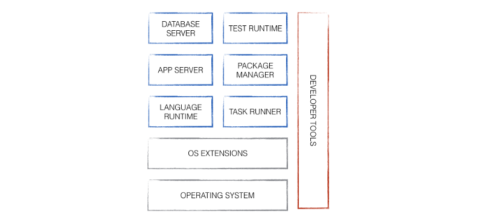
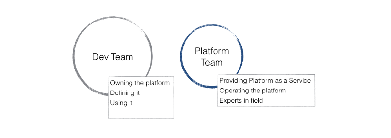
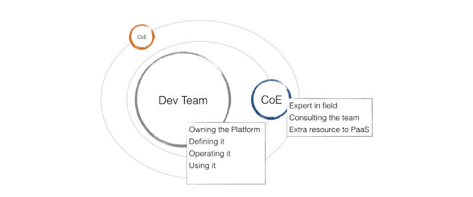
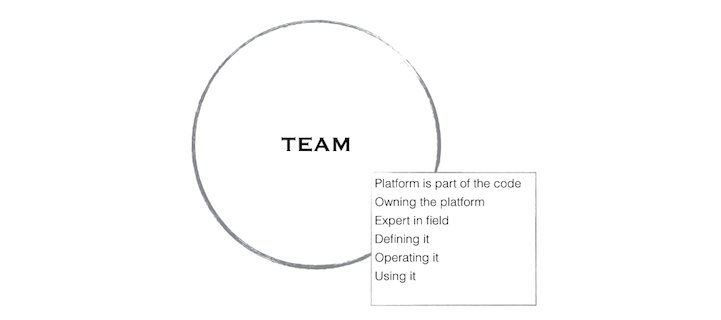

In this post, I would like to turn the spotlight again to the power of self-contained application:

[**My take on the self-contained application**  
*This is the only sentence here that contains the word microservice.*medium.com](https://medium.com/@zsim0n/my-take-on-the-self-contained-application-44f6bfc8acb0 "https://medium.com/@zsim0n/my-take-on-the-self-contained-application-44f6bfc8acb0")

As you can see there, the platform and infrastructure manifest is part of the code repository.

    infrastructure.manifest    # my.infrastucture  
    platform.manifest          # my.platform

A more practical example could be like this:

    package.json         # npm platform  
    Gemfile              # Ruby platform  
    Rakefile             # Build tasks  
    Dockerfile           # Infrastructure  
    .env                 # Environment variables

> Your platform becomes part of your code, but what does that mean?

### Platform as Code

In the past, a platform was a separated entity, optimized for operations. Usually, a dedicated team was responsible for defining and maintaining a platform. T*hey had their own thing, sometimes with hidden agendas and surprises.*

Moving these definition into the codebase makes them natural part of the application as it is visible and accessable for anyone. As an additional result they become versioned and can also follow software development practices. This ignites a natural collaboration and a lifecycle around the platform.

> A healthy lifecycle eliminates technical debt and replaces it with refactoring and optimization.

### But what is a platform?

Let’s take a look at what actually a platform is.

A platform is a set of software. From a technical point of view, a platform in general is the context where an application is *living*. Some says it’s like a glue that holds things together. Platform as concept helps to simplify the complexity of this layer.

> You might call it **middleware** which is as good as any other label until it helps the understanding. I prefer **platfrom** because it is covering a wider more abstract view.

A platform contains all the softwares and tools that are necessary for *execute — test — develop — operate* an application. It can include the language run-times, app servers, database servers, task runners, package managers, test run-times, shell-extensions, development tools and the operating system itself.

> Yes, a platform is including both the operating system and the development tools.

You can look at these elements as services that are available for supporting the application.

#### Every application has its own platform

The original goal of defining platform was to make optimization and comfort for operations. The focus often was having as few platform as possible. Actually having only one was desired.

The challenges of adaptability and flexibility of the current competitive business environment turns the focus to development. Development teams has to live up to the challenge and utitilize methods such as agile application development and continous delivery.

A platform manifest establishes an interface between the application and the underlying services. The capablities of the different elements are the playground and the boundaries for the applications.

Platform as code enables to every application the freedom and gives responsibility describing their own execution environment within the given boundaries. The team can modify, tune and upgrade according to the latest requirements.

Because of the self-containment it will be irrelevant how much platform and variations are existing.

> Every application can have it’s own platform.

### Competences

Setting up and operating a platform still requires certain competencies. Moving the platform into the code doesn’t mean that you are transferring the competencies to other places. You need to find an organizational structure that fits best for your requirements. Here is a few options:

#### Keeping the platform team together

You can keep the original platform team together and they continue maintaining the platforms. You are moving only the ownership of the platform to the developer team. The developer team is defining and updating the specifications, the platform manifest. The platform team delivers the competencies as a service to operate the platform. Developer team becomes the driver of the development of the platform. They are going to have close collaboration with each other but still separated.

#### ***Center of Excellence***

Another approach can be that the developer team has much more responsibility. They own, define and operate the platform. They can survive the everyday challenges, but they need external experts helping them for strategic decisions and on a crisis. The developer team has no expert competence instead a team of experts gathered around them are providing these services.

#### ***Cross-functional teams***

A cross-functional team is where all the expertises are available for delivering the software within the team. They can manage the full stack from architecture, infrastructure management to coding and test.

### The good parts

When you have the *platform as code* and you have a committed organisation in place, you start getting the good parts out of this setup.

> A living platform

*   You will be able to adjust and update the platform as necessary to fit the latest requirements. There will be no latency on that.
*   You are always getting a current overview of all your platforms, including software packages and versions.

> The platform becomes accessible

*   Provisioning a platform will be part of the continuous build and deployment practices. You are able to test your platform’s compliance early.

> It is code, It is automated.

*   Optimizing the platform architecture will not require extra effort anymore.
*   Operations can give real-time feedback about the status of production and other stages for analysis.

> No more hand-overs, just teamwork

[**More on Feature Teams…**  
*Feature areas may begin to shift over time. For example, user profile functionality would have never affected external…*www.linkedin.com](https://www.linkedin.com/pulse/more-feature-teams-alex-yakyma?trk=hp-feed-article-title-share "https://www.linkedin.com/pulse/more-feature-teams-alex-yakyma?trk=hp-feed-article-title-share")

*   If you are a decision maker fx. a Chief architect, you can put real goals on optimization because you have the data for validation. There will be a real working interface between Stakeholders, Development and Operations.

#### Conclusion

*Platform as a code* is a way to enable and engage the team for better quality. *Platform as concept* is a way to organizing execution environments as part of your software. P*latform lifecycle* establishes the routine that avoids generating technical debt.

The final result is good architecture, great software and a happy engineering team!

* * *

#### External resources

Finally a few great whitepapers on the topic:

[What is an Application Platform by Chappell](http://www.davidchappell.com/writing/white_papers/What_is_an_Application_Platform-Chappell.pdf)

[What is ALM by Chappell](http://www.davidchappell.com/writing/white_papers/What-is-ALM--Chappell.pdf)