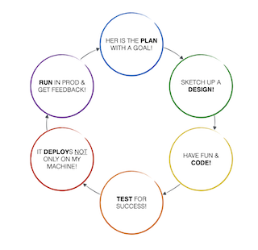
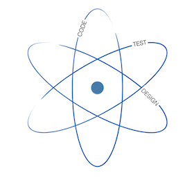
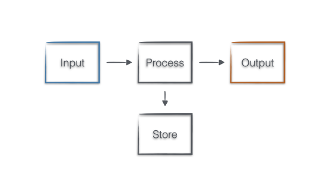
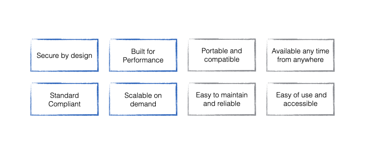

Software engineering is yet another professional craftsmanship with rules, practices, tips and tricks and tools.  You might think the whole point with Low-Code / No-Code is that you can ignore the many annoying IT-related things. But remember, you just have switched one element from the entire picture, a tool by choosing the path of Low-Code / No-Code. The software you produce many will depend on, and they expect the same experience and quality as they used to. A secure, reliable, well-performing application that is easy to extend, maintain and a joy to use.

Start with a quick recap from my programming teacher to set the scene:

> A computer is following your instructions, not your wishes. The only valid measurement of code quality is WTFs/minutes.

### The infamous software development lifecycle - SDLC
As in every profession, software development also has the barebone sequence of activities to ensure consistent production. 

To create great software, you repeat these steps all the way down from product vision to day-to-day coding.

> Atom comes from the word ἄτομος in greek and means indivisible. 

There is also an essential concept in software development that cannot be broken. 

There might be a difference in priority, size and complexity, but these steps are always there.  The key is not skipping one or two with the illusion of saving time and/or money. You need all of them as an Atom to succeed. Splitting an atom is possible, but there will always be dramatic consequences. Here are the most common ones:
- Skip the test to save budget or meet a deadline. The result is basically useless software that consumes more money to just keep it alive.
- Skip the spec and jump to Code because "you know better". The result is an infinite project; you cannot prove you have done the right thing.
- Skip everything and just ask, "Someone just make it work".  It is like burning your money in a fireplace. You better offer it for charity.

Here is a brief checklist to be better with these cycles:
- __Make a plan and a design.__ Don't rush with coding/clicking. Sit down with future users and try to figure out the goal you want to achieve. If nothing else, draw some screens and processes on a whiteboard or a napkin and take a photo.  It helps to keep you on track later. 
- __Devine and concur.__ Split up the work into as small pieces as possible. Develop one thing at a time and make it work before you move on.
- __Keep it simple.__ Remember, you have started the whole thing to make something more straightforward; keep it that way. Why collect a bunch of data to store when you ask other applications to deliver the data you need.
- __Have fun when Code!__  Involve others regularly, show them where you are on the journey. It helps adjust the expectations. 
- __The great thing about software is that it is soft.__ You can throw it away anytime and start again. Usually, this is the most effective way to achieve your goals.
- __The bigger picture.__ Fokus on the interfaces that connect your application to the surrounding ecosystem. Think about how your application plays with others to deliver a seamless user experience instead of laser focus on your feature delivery.

You can Google about Agile software development, Behaviour Driven Development (BDD), Test-driven development (TDD), Domain-Driven Design (DDD) to learn more.

### Algorithms are the very heart of programming.
The nerdiest part of software engineering is working with algorithms, and honestly, I love this part the most. It is basically applied math - where terms like Set theory, Category theory, Graph theory, B-Tree traversal flies around. But before you get dizzy, here is the thing: Most of the time, you will optimizing, automating business processes. These processes can be handled with a simple model, the Input-Output machine (I/O'mat) 

Your application takes __Inputs__:
- A form that the customer fills out.
- A file received by e-mail
- Data collected from another application. 
Then you have to do something with the data. __Process__ it, aggregate it. Sometimes your machine has to remember (__Store__) what happened earlier to compare or collect information through time (__State__)
Finally, you need to present it (__Output__) somehow.
- Show on a screen
- Send a file as an e-mail attachment 
- Deliver the data to another application. 

Every process can be dismantled into these small machines working together. You can think of a form to fill out; a report to send an I/O' mat is the way to go.

The great thing with this approach you split a more significant problem (a process) into smaller chunks that you will be able to solve one by one. 
Another benefit is that you can focus on the Data flow, the essential aspect of the problem. 

You can start the work by defining the Inputs and Outputs, the interfaces that will determine what and how you have to create to collect and validate the data. (Fields on the form, the columns in Excel, the x-y axis of a chart). With these, the data processing part will be a peace-of-cake exercise ;)

You might have heard the expression *API first* or *Contract first* from developers  - Here you go, you've just learnt what they means! 

### Security by design? What the hecks are the Non-functional Requirements (NFRs)?
You might have been overheard discussions among developers about plumbing or seen a presentation from architects with buzzwords like secured by design, built-in performance, compliant to XYZ standard.
These are well-proven properties for every application that must be reviewed to ensure success in production. They are called  Non-functional Requirements or NFRs. Typical NFRs to look at are *Performance, Security Usability, Reliability, Scalability, Compliance* etc.

Here are a few highlights for starter:
- __Security__ - Be sure you understand how access control works. You can configure and explain how the forms and dashboards reports are accessible, whether behind a login or publicly available. 
- __Performance__ - Check if your platform (licenses) covering the needed capacities, both storage and for peak performance. Peak performance is like a rush-hour when everybody wants to work with your app simultaneously.
- __Compliance__ - Together with the platform provider, validate and document how the platform handles data. Check and double-check that you manage privacy after the book (GDPR) and with good faith. The data you collect is not just floating in the cloud somewhere, but you know where it is and be sure it is encrypted.

This short summary barely scratches the surface but hopefully gives you some valuable insight. Now, you know the basics. Nothing can stop you from discussing the topic with software engineers and architects with confidence to get help. Together you will indeed deliver great apps, whether it is No-Code, Low-code or Code. Don't hesitate to contact me if you have any questions to get started or get over an obstacle. *Happy No-coding!*