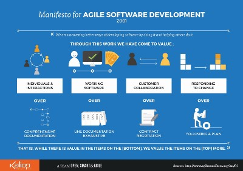
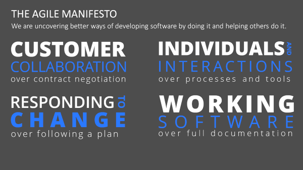
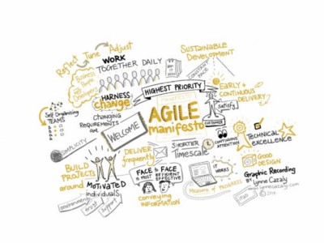
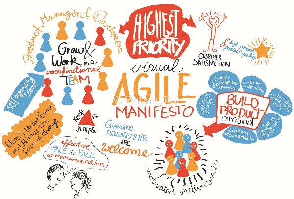
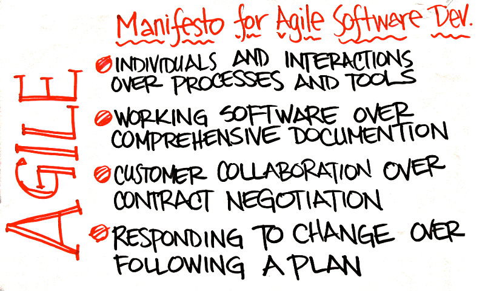
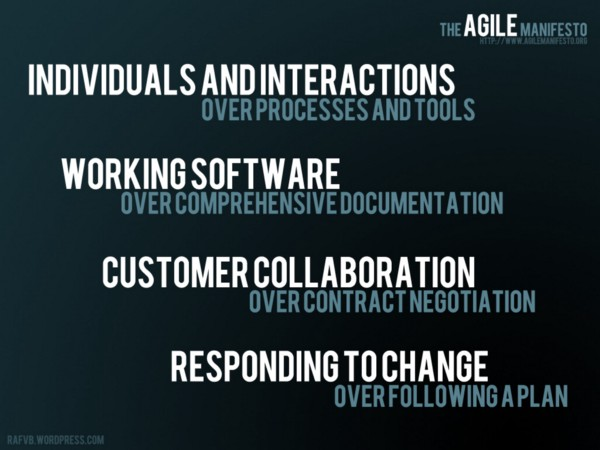
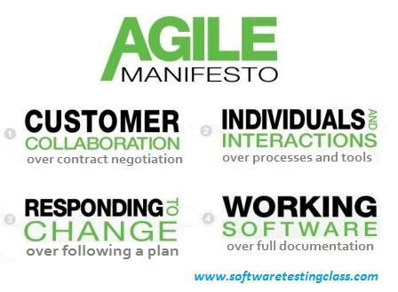

*Originally posted on* [*Linkedin*](https://www.linkedin.com/pulse/stop-moment-visit-agile-manifesto-zoltán-simon)

<figcaption>Image credit — <a href="http://deathtothestockphoto.com" data-href="http://deathtothestockphoto.com" class="markup--anchor markup--figure-anchor" rel="nofollow noopener" target="_blank">deathtothestockphoto.com</a></figcaption>

I have had talks and activities around DevOps and Agile transformation all week long. It is weekend now, and I thought it is time for a short reflection on the week. We people has the tendency to forget the core values behind the scene. We are running in the hamster wheel, focusing on edge cases or generalising everything. I felt it is time to remember the main driver behind all frameworks, methods and tools in the agile movement.

#### The simple and clear manifesto we should use everyday:

> Individuals and interactions over processes and tools

> Working software over comprehensive documentation

> Customer collaboration over contract negotiation

> Responding to change over following a plan

[**Manifesto for Agile Software Development**  
*We are uncovering better ways of developing software by doing it and helping others do it. These are our values and…*agilemanifesto.org](http://agilemanifesto.org "http://agilemanifesto.org")

#### Image credits:

*   [http://www.softwaretestingclass.com/agile-manifesto-and-principles/](http://www.softwaretestingclass.com/agile-manifesto-and-principles/)
*   [https://rafvb.wordpress.com/2012/10/18/agile-manifesto-wallpapers/](https://rafvb.wordpress.com/2012/10/18/agile-manifesto-wallpapers/)
*   [http://blog.twg.ca/2009/04/selling-agile-are-estimates-the-new-spec/](http://blog.twg.ca/2009/04/selling-agile-are-estimates-the-new-spec/)
*   [https://pritamsen.wordpress.com/2014/04/14/agile-manifesto/](https://pritamsen.wordpress.com/2014/04/14/agile-manifesto/)
*   [http://www.lynnecazaly.com.au](http://www.lynnecazaly.com.au)
*   [http://blog.presentationload.com/efficient-agile-project-management/](http://blog.presentationload.com/efficient-agile-project-management/)
*   [http://blog.kaliop.com/en/blog/2015/04/02/draw-me-an-agile-manifesto/](http://blog.kaliop.com/en/blog/2015/04/02/draw-me-an-agile-manifesto/)
