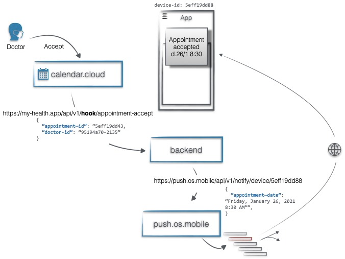
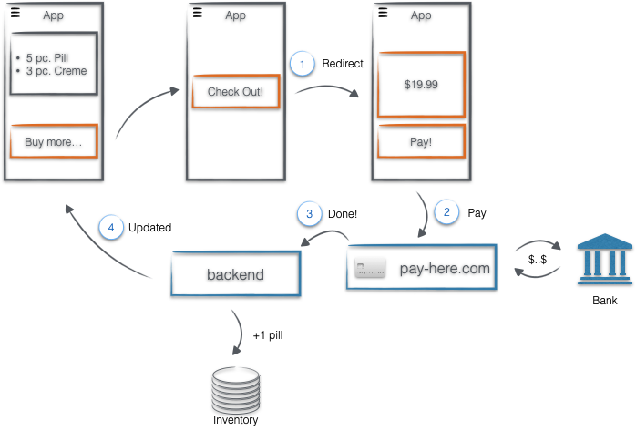

Words like asynchronous, RESTful API, Event-driven Kafka, or Microservice pops up in discussions, and you might feel something is missing. What do these words imply? You can find explanations for the most common terms and insights on how to deal with them in application design. 
Designing solutions today is almost always about how to connect applications and services into a meaningful network. To help enhance common vocabulary, let's revisit the key concepts.

**Synchronous** or **Asynchronous** refers to the **behavior of the application** requesting the resource. **Synchronous** behavior is when the application constructs a request, sends over the connection, and waits for the response (blocking the execution). It also means connected or dependent in some way. **Asynchronous** behavior is when the application constructs the request, sends out, and moves on. It has a separate logic (a thread) listening to the connection, waiting for the response, and acting on it when it arrives.

**Messaging** is the most popular communication style to connect distributed applications into a network. The basic unit of this communication is the **message**. The intent determines if a message is an **event** or a **command**. **Events** inform various **listeners** about something that **has happened** and is already completed (**in the past**). It's sent by a **producer** who doesn't know or care about the **consumers** of the event. **Commands** initiate something which **should happen** (**in the future**). It is a direct connection between the **producer** and a **consumer**.

**Request-response** and **Publish-subscribe** are the two basic patterns applications use to communicate with each other. **Request-response** is a simple yet powerful two-way communication between applications. The pattern typically implemented **synchronously**; however, with a response returning at some unknown later time, the connection can be **asynchronous.**

**Publish-subscribe** allows us to broadcast messages between applications **asynchronously**. Eventually, the **publisher** places **events** to a **message broker** that **subscribers** can then subscribe on. The publisher and the subscriber are not aware of each other's identity.

An example of **Publish-Subscribe** style asynchronous event-driven application would be an order processing application that places orders in a queue, from which one or more subscribers can process it (e.g., a logistic application can handle requests independently). Another example when a service that accepts user signups can send notifications whenever a new user registers, and downstream services can subscribe to receive notifications of that event.

Browsing the web through HTTP is the trivial example of **asynchronous**  **request-response communication**.

For **command-based**  **synchronous**  **request-response** communication, the online shop checkout process could be an example. The online shop sends a request(command) to the payment service to process the payment by clicking the order button. The checkout process only continues with allocating the stock after the payment is successfully executed.

**Point-to-point** and **hub-and-spoke** topologies are at the opposite ends of the connectivity. A **point-to-point** model connects applications directly. It is quick and efficient to build point-to-point connections. The typically listed cons are lack of scalability, security risk, and maintenance cost. A **hub-and-spoke** model connects applications through a central mediator called a hub. It optimizes the number of connections, improves reusability, security. On the other hand, it is a single point of failure; scalability also can be an issue.

The popularity of point-to-point connectivity is growing due to the increased ease of access to managed APIs. It is the simplest and most efficient way to embed cloud services (SaaS) and coding to APIs, without the cons of classic point-to-point integration.

The communication patterns and styles above are also the core motivators in many application architecture patterns. Event-driven architecture, for example, exclusively uses asynchronous event-based communication to deliver loosely coupled services. The client-server architecture was initially built around request-response communication. On the other hand, microservice architecture is a backend or system-to-system architecture focusing on decomposing the solution into specific services. Microservices can be interconnected both synchronously and asynchronously.

> Learning, by example, is sometimes more comfortable.  

Imagine an app that shows your health information and allows you to interact with your GP. The highlighted features will showcase the concepts above:

The Overview screen presents your Journal (doctor visits, diagnoses, etc.). It also gives you the basic info about your blood. The data comes from two different external services and accessible through a RESTFul API. The app connects to these services directly and shows the data immediately when it is available. **It is a typical example of asynchronous, point-to-point code to API implementation.**

The app sends a notification when a doctor approves an appointment request. The backend wires an external calendar service that manages the GP calendar to the built-in notification service via webhooks. **This part of the application follows the event-driven architecture pattern**. You can also see the typical profile of event-command-event in this component.

It is also possible to initiate the purchase of medicine and manage the inventory within the app. The app only shows the purchased drugs. The solution is to block the app until the payment provider reports a successful payment and only refreshes the inventory after that. **It is a typical synchronous (blocking) communication scenario.**

#### Summary
In solution design, the goal is to find the right balance and combine these architecture patterns and communication styles. Choose the model in harmony with the problem!

*   A need for asynchronous communication is not necessarily event-driven.
*   Handling RESTful APIs can be synchronous and asynchronous, depending on the application implementation.
*   HTTP is a request-response protocol by design. It is possible to implement a publish-subscribe pattern on top of that too.
*   Event is a type of message and can be part of other architecture also. It is not exclusive to event-driven architecture.
*   Managed APIs are the way for point-to-point connectivity.