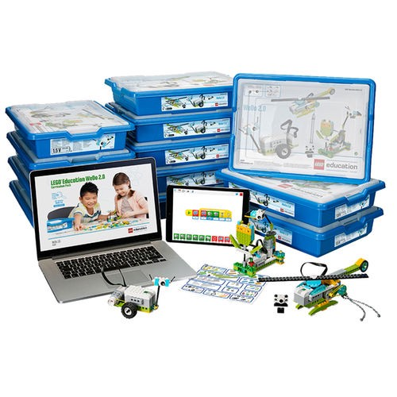

20th anniversary of Goto Copenhagen brought a group of exceptionally great speakers and talks this year. I would like address one of the topics in this post:

[*“Educating the builders of tomorrow with science and technology skills using LEGO® Education WeDo 2.0" -Hanne Hylleberg Ravn, Flemming Bjørn Jessen*](https://gotocon.com/cph-2016/presentations/show_talk.jsp?oid=7766)

<figcaption>Lego: <a href="https://le-www-live-s.legocdn.com/images/423923/live/sc/Products/5004833/5004833_1050x1050_1_xx-xx/c5fb45cce123af76735136c9a62da317/80218c5f-b088-42c5-9252-a58700e5045b/original/80218c5f-b088-42c5-9252-a58700e5045b.jpg?output-format=jpg&amp;fit=inside%7C500:500&amp;composite-to=*,*%7Chttps://le-www-live-s.legocdn.com/sc/static/bg-max.jpg?resize=500:500" data-href="https://le-www-live-s.legocdn.com/images/423923/live/sc/Products/5004833/5004833_1050x1050_1_xx-xx/c5fb45cce123af76735136c9a62da317/80218c5f-b088-42c5-9252-a58700e5045b/original/80218c5f-b088-42c5-9252-a58700e5045b.jpg?output-format=jpg&amp;fit=inside%7C500:500&amp;composite-to=*,*%7Chttps://le-www-live-s.legocdn.com/sc/static/bg-max.jpg?resize=500:500" class="markup--anchor markup--figure-anchor" rel="noopener" target="_blank">80218c5f-b088–42c5–9252-a58700e5045b.jpg</a></figcaption>

The presentation was a great product showcase of [WeDo 2.0](https://education.lego.com/en-us/shop/view-all-products?product_lines=WeDo2) from Lego.

The topic of **introducing technology in Education** is what I would like to focus on today. Checking the product site and talking with the Lego guys the following question hit me:

> Why WeDo 2.0 is not available for free for elementary schools in Denmark? Huge corporations are many times generous with their spectacular projects:

<figcaption><a href="http://www.visitcopenhagen.com/copenhagen/royal-danish-opera-house-gdk422032" data-href="http://www.visitcopenhagen.com/copenhagen/royal-danish-opera-house-gdk422032" class="markup--anchor markup--figure-anchor" rel="noopener" target="_blank">The Royal Danish Opera&nbsp;House</a></figcaption>

> Wouldn’t it be great if Lego with other successful Danish companies join with State/Municipalities and make these kits available gratis for schools?

I know I know, It is easy to play with other people’s money. Can I just think loud for a moment?

There are **ca 1300** elementary level schools in denmark. The list price of a WeDo 2.0 ReadyGo 24-Student Pack is **1920 USD**.

A 10% coverage (130 schools) with average 2 box per school is a **$500.000** value investment into the future. *(this is on list price without any discount !).* I am guessing a 10% $50.000 yearly maintenance fee. Converting it into Danish kroner it is ca. 3.300.000 dk — the price of a house, and ca 330.000 dkk per year — the price of a family car in Denmark.

Is this a lot of money? **Yes!** Does it worth it? **Definitely YES!** Can it happen? ***I have no idea.***

But I really hope that more and more companies recognise the importance of investing into the future of our children.

Thanks for your attention.
