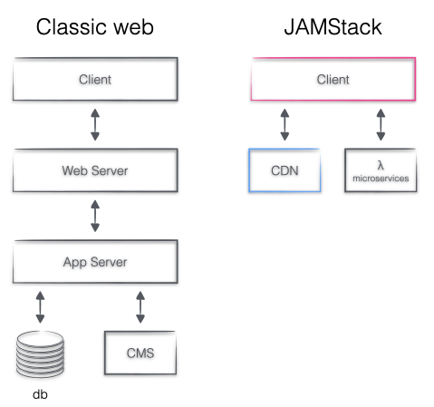

I felt walled into a garden. It was time to move on. I've also needed something real to work on (my PowerPoint skills is another story). So I've decided to free my blog and own my full stack again. But not in Perl or PHP this time :)

I, of course, faced a classic migration problem: 
- *wisely* :) select the new toy
- manage to transfer the assets from the old ([medium.com][1]) to the new site
- switch over to the new setup (this part was pretty simple thx for [Netlify][2] & [Goddady][3])

## JAMStack
I've put the following constraints toward my new platform:
- I want to control and host the full stack
- I'd like to work with React.js
- I need just enough features for a blog. No CMS Monoliths! 
- I don't want to pay monthly fees for casual content creation.
- I want to avoid any SysOp related tasks.
- Preferably effortless migration 

> For a moment I've almost just turned to wordpress.com. Luckily it was just a moment of doubt.

I quickly ended up with the [Gatsby][4] - [Contentful][5] - [Netlify][2] JAMstack. [JAMstack][6] stands for __J__avaScript, __A__PIs, and __M__arkup. My shortest answer for the why is this picture:

That could be followed by a lengthy essay with my arguments, but let's focus on the migration journey this time.

## Migrate
In the end, I ran a full circle, of course. Ended up building up the stack from scratch. Here you can follow my journey so you might able to take some shortcuts.

### Gatsby Cloud
Naturally, I could just build a Gatsby site from scratch. There are plenty of starter packs. But I decided I want it fast, and I don't care what's under the hood until it just works. I went directly to [Gatsby Cloud][7]. Signed up. A few clicks later, I had my blog hosted on Netlify, connected to my brand new Contentful space. The Gatsby source code committed to a Git repository on Github, and all of these wired together nicely. Perfect! I own the code, the content, the pipeline, and the hosting. 

One little thing, though. There was no content and no tooling or help for migrating content from the Medium. I've looked up how to do migration from Medium to Contentful manually. Still, it looked cumbersome and not easy, so I gave up on that. 

### Stackbit
As of now, I knew it is possible to get a blog in a matter of a few clicks. I've narrowed the problem to :

> "how to migrate Medium to Contentful." 

I deep-dived into Github to find an answer. This is how I've discovered [Sourcebit][8] and through that [stackbit.com][9]. Where they have a button "[Medium Import][10]"

AND IT JUST WORKS! 

### Circle closes
> "The price of freedom is eternal vigilance. - Admiral Tolwyn, Wing Commander IV

I was happy. I had a nice setup with my posts migrated to Contentful. I got a lovely looking template and pre-configured pipeline from Stackbit. Everything just works! What's not to like?

Then I started looking under the hood. I wanted to feel I am still controlling my new shiny stack. Slowly it turned out that both Stackbit and Gatsby keep critical elements of the stack out of our hands to ensure the service's quality. I've also missed my favorite design framework, Material UI.

After all these experiments and learnings, I've kept the nicely migrated content in Contentful. Thx StackBit! Then I simply built the site from scratch on top of a Gatsby vanilla starter pack.

It was a great coding/framework experience. Selecting the right plugins, stitching together Material UI, Gatsby, and Contentful.

Setting up Netlify. Learning how to do a preview with Contentful and the local dev environment.

You can check the [git repo][11] for technical details and enjoy the [site][12]. 

##  Takeaways

- There are fantastic services out there to heavy-lift the boring parts for you. Both Gatsby Cloud and Stackbit present superb services for content creators to get more ownership of content and the underlying technology stack. 
- This "magic," of course, also has a small price and binds you to the service. Still, freedom of choice has been given back to you.
- Migration, even at this scale, is full of dead ends and surprises.
- My biggest takeaway from this journey is to put content/data portability in the first place. I would say design your next solution with data portability in mind. The rest is a piece of cake compared to that.
- Another one is experimenting is not a waste of time. 
    - I've added something from each experiment (pipeline automation and stack basics from Gatsby cloud, content migration from Stackbit)

[1]: https://medium.com/@zsim0n
[2]: https://www.netlify.com/
[3]: https://godaddy.com/
[4]: https://www.gatsbyjs.com/
[5]: https://www.contentful.com/
[6]: https://jamstack.org/what-is-jamstack/
[7]: https://www.gatsbyjs.com/cloud/
[8]: https://github.com/stackbithq/sourcebit
[9]: https://stackbit.com
[10]: https://www.stackbit.com/medium/
[11]: https://github.com/zsim0n/splendid-sycamoren
[12]: https://zoltansimon.me/