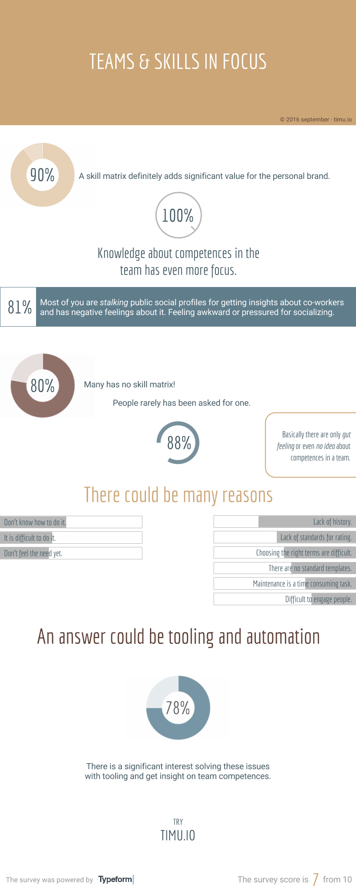

And this is good news. You are focusing on the right thing: **Your team**. Your curiosity is the base for innovation, keep it up! I would like to **Thank you** all of you that filled out the [survey](http://timu.io/survey) about skills, teams and feelings. I have created this infographics below for summarise the results. *Enjoy*!

*I am more confident now to put effort into* [*timu.io*](http://timu.io/) *and give it a try.*

*Originally published on* [*Linkedin*](https://www.linkedin.com/pulse/you-curious-your-team-skills-have-zoltán-simon)
